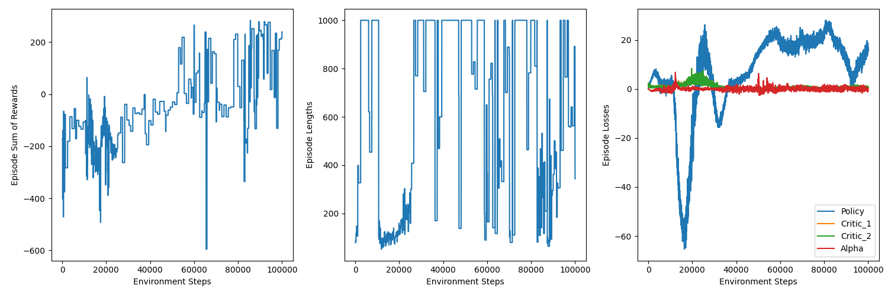

# Implementation of Soft-Actor-Critic (SAC)
This repository consists of a basic framework that allows to easily load a Gym environment and optimize an agent using SAC.
The SAC algorithm: [Soft-Actor-Critic](https://arxiv.org/abs/1801.01290).

## Installation
The code is written in python 3.10 and uses the following packages:
- [PyTorch](https://pytorch.org/)
- [NumPy](https://numpy.org/)
- [Gym](https://gym.openai.com/)
- [Matplotlib](https://matplotlib.org/)
- [Pandas](https://pandas.pydata.org/)

## Usage
### Single Experiments
Experiments with a set of hyperparameters can be run with the `main.py` script. 

### Hyperparameter Grid Search
Experiments to find the best hyperparameters can be run with the `hpo.py` script.

### Evaluation
The `evaluate.py` script can be used to evaluate a trained agent.

## Results

   

## TODO
- [ ] Make a version that uses PyTorch Lightning
- [ ] With PyTorch Lightning, make use of Weights & Biases for logging
- [ ] Add support for distributed training (Vertex AI)
